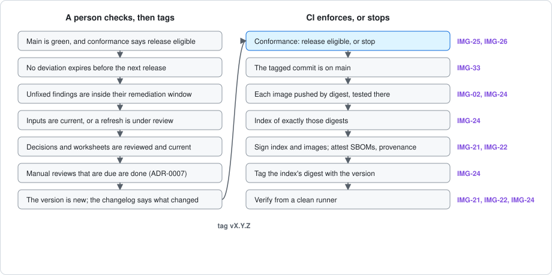

# Releasing an image

What a person checks before a release, and what CI then enforces. The
[reference web server](../examples/reference-web-server/README.md) is released
this way, and an adopting image follows the same list; its CI is copied from
the reference image's as [ADOPTING](ADOPTING.md#releasing-more-than-one-architecture)
describes.

## Before tagging: a person checks

CI refuses a release that is not release eligible, but some of what makes a
release sound is judgement, not a gate. Check each of these on the commit to be
tagged, and say in the pull request or release notes that you did.

- [ ] **Main is green, and conformance says release eligible.** Read the
      conformance job's summary, not the badge: it lists every release blocker.
- [ ] **No deviation expires before the next release.** A deviation that
      lapses while a version is current makes that version fail its checks. Close
      the gap, or record a new decision, first.
- [ ] **Unfixed findings are inside their remediation window.** The gate stops
      a fixed High or Critical finding; it does not stop an unfixed one. Read the
      recorded findings, and check none has been open longer than
      [IMG-25](standard/criteria.md#img-25-vulnerability-gate-and-remediation)
      allows.
- [ ] **Inputs are current.** The drift report says how far each base and
      package is behind. If a refresh is due, merge it first, as its own reviewed
      change.
- [ ] **Decisions and worksheets are reviewed and current.** Every decision in
      the decisions worksheet has a reviewer; every applicability worksheet was
      made against the release the register pins.
- [ ] **Manual reviews that are due are done.** Where a criterion is evidenced
      by a person's inspection rather than a test, the review must be current.
      How such reviews are recorded is proposed in
      [ADR-0007](adr/0007-record-manual-reviews-as-expiring-evidence.md).
- [ ] **The version is new, and the changelog says what changed.** A version is
      published once and never replaced. Raise the minor version when what is
      published changes shape, such as a single image becoming an index; the
      patch version for anything else.

## After tagging: CI enforces

Tagging the reviewed commit on main starts the release. Each step stops it if
it fails:

| Step | Holds |
| --- | --- |
| Conformance says release eligible | [IMG-25](standard/criteria.md#img-25-vulnerability-gate-and-remediation), [IMG-26](standard/criteria.md#img-26-exceptions-expire), and every other required criterion |
| The tagged commit is on main | [IMG-33](standard/criteria.md#img-33-source-is-protected-and-traceable) |
| Each architecture's verified image is pushed untagged by its own digest, checked to be the image conformance judged, and tested again at that digest | [IMG-24](standard/criteria.md#img-24-immutable-tags) |
| An index naming exactly those digests is pushed, by its own digest | [IMG-24](standard/criteria.md#img-24-immutable-tags) |
| The index and every image are signed; each image's bill of materials and the index's provenance are attested | [IMG-21](standard/criteria.md#img-21-bill-of-materials), [IMG-22](standard/criteria.md#img-22-signed-with-provenance) |
| The version tag is added to the index's digest, refusing one that exists | [IMG-24](standard/criteria.md#img-24-immutable-tags) |
| A fresh runner with no registry credentials verifies the result | [IMG-21](standard/criteria.md#img-21-bill-of-materials), [IMG-22](standard/criteria.md#img-22-signed-with-provenance), [IMG-24](standard/criteria.md#img-24-immutable-tags) |

An image that pushes its candidates before conformance runs can bind the
judgement to them: pass the conformance workflow `candidates` as
`amd64=sha256:… arm64=sha256:…`, and every architecture's evidence must then be
about that digest.

## If a release fails

Nothing is replaced. A failure before the version tag is added leaves only
untagged images, which nothing refers to; fix the cause and tag a new patch
version. A failure after it, in the clean verification, means the published
version does not verify: say so in the release notes, fix the cause, and
release a new version. The failed one is not re-tagged.
