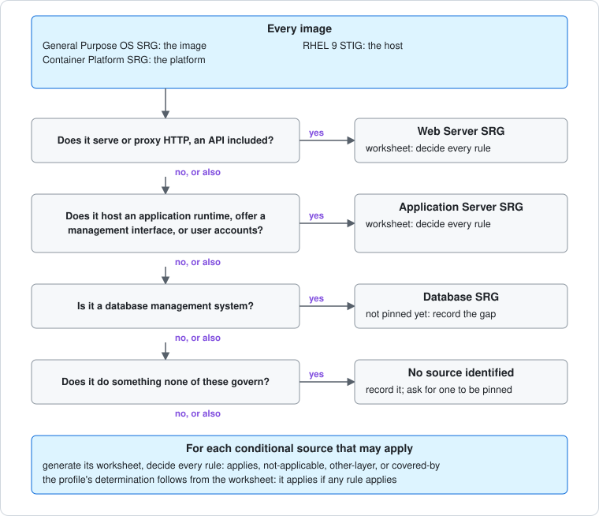

# Which SRGs an image takes

Every image takes three sources whatever it does. The others are
**conditional**: they govern a kind of software, and an image takes one when
it is that kind of software. This page is how to decide, and how to record the
decision so a reviewer can check it rule by rule. The mechanism it feeds is
[tailoring](../TAILORING.md#applicability).



## Always

| Source | Governs | Where it goes |
| --- | --- | --- |
| [General Purpose Operating System SRG](../srg/general-purpose-operating-system-srg/README.md) | The image itself | The [criteria](../standard/criteria.md) |
| [Container Platform SRG](../srg/container-platform-srg/README.md) | The platform that runs it | The [platform expectations](../standard/platform.md) |
| RHEL 9 STIG | The host | The host expectations |

These are not decided per image, and have no worksheet.

## When a conditional source applies

| If the image | It takes | State |
| --- | --- | --- |
| Serves or proxies HTTP, an API over HTTP included | [Web Server SRG](../srg/web-server-srg/README.md) | Pinned and rendered |
| Hosts an application runtime, offers a management interface, or manages user accounts | [Application Server SRG](../srg/application-server-srg/README.md) | Pinned and rendered |
| Is a database management system | Database SRG | Not pinned yet |
| Does something none of these govern, such as object storage or messaging | No source identified | Record the gap |

**More than one can apply.** The questions are not exclusive: an HTTP API that
manages its own users and access keys takes both the Web Server SRG and the
Application Server SRG, and a database with an HTTP administration console
takes the Database SRG and the Web Server SRG. Answer every question.

**An HTTP application is not only a web server.** An object store, a catalogue
service, or a metrics endpoint that speaks HTTP is governed by the Web Server
SRG for how it serves HTTP, and by the Application Server SRG if it
authenticates clients or offers administration. Many of the two SRGs' rules
state the same requirement for different software; the worksheet shows which,
because it lists, for each rule, the rules of the other sources that share a
CCI with it.

**A source that is not pinned is a gap, not a pass.** Record it in the profile's
`function`, and in the image's own notes, until this repository pins one.

## Decide every rule: the worksheet

For each conditional source that may apply, generate a worksheet from the
pinned catalogue and decide every rule in it:

```sh
python ../container-hardening/scripts/worksheets.py applicability new \
    --source disa-web-server-srg --also disa-application-server-srg \
    --image my-image --out applicability/web-server-srg.json
```

| Decision | When | Needs |
| --- | --- | --- |
| `applies` | The image has what the rule governs | Nothing more; the criteria and the image's requirements carry it |
| `not-applicable` | The image has nothing the rule governs | A basis that names what is absent |
| `other-layer` | The rule governs the platform or the host, not the image | A basis |
| `covered-by` | Another source's rule states the same requirement in terms that fit the image better | A basis, and the rule, as `<source>:<Group ID>` |

`shares_cci_with` suggests candidates for `covered-by`; it does not decide
them. Two rules sharing a CCI serve the same control, not necessarily the same
requirement.

Check it, then cite it as the determination's `evidence` in the hardening
profile:

```sh
python ../container-hardening/scripts/worksheets.py applicability check applicability/web-server-srg.json
```

`check-profile.py` then holds the determination to the worksheet: it must be
complete, made against the pinned release, and `applies` must be true if any
rule applies. When the register pins a new release, the worksheet is stale and
is regenerated and decided again.

## The reference image

The [reference web server](../../examples/reference-web-server/README.md)
serves static content over HTTP and has no runtime, management interface, or
accounts. It takes the Web Server SRG, and determined the Application Server
SRG not applicable by the rule categories in
[application-server-srg.md](application-server-srg.md), which predates the
worksheet. Deciding both rule by rule is on the [roadmap](../ROADMAP.md).
