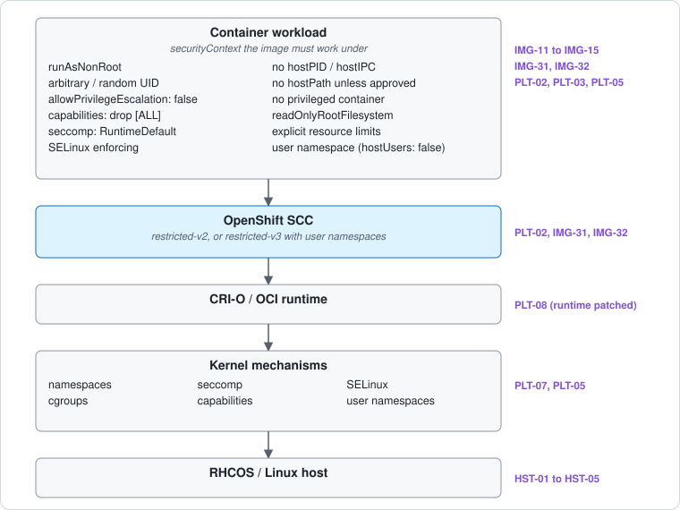
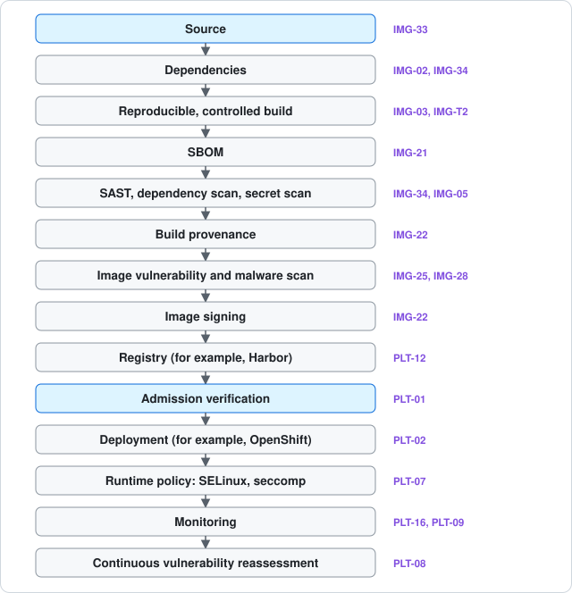
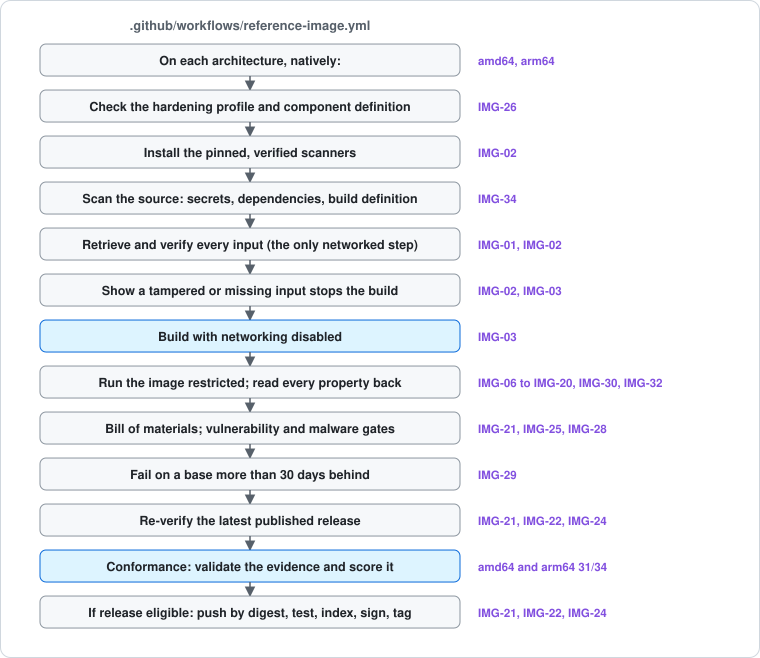
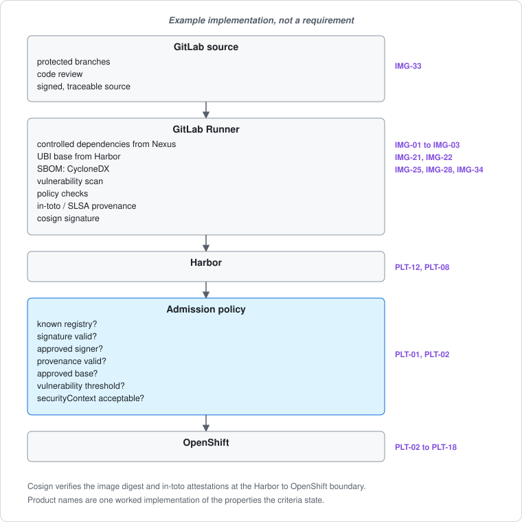
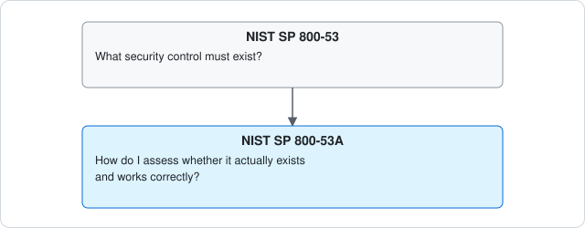
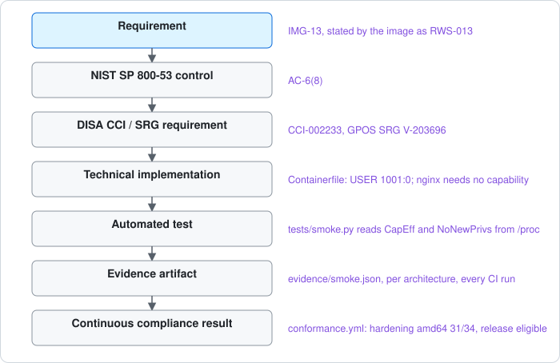
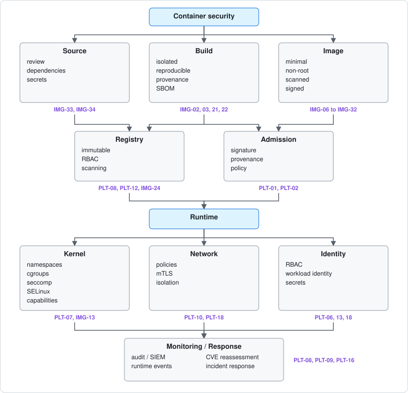

# Reference architecture

How container security fits together, from source to response, and where each
part of [the standard](../standard/README.md) sits in it. It is the map; the
criteria, expectations, and control baseline are the territory.

## NIST SP 800-190 is one piece

[SP 800-190](../standard/nist-800-190.md) is still useful, and this standard
follows it countermeasure by countermeasure. But it dates from 2017. It
describes threats across images, registries, orchestrators, containers, and
host operating systems, and since then Kubernetes and OpenShift,
software-supply-chain controls, and container runtime hardening have all
moved substantially. A modern container-security standard is not built on it
alone.

For a RHEL and OpenShift, disconnected, DoD-oriented environment, the
baseline is built from these layers. Every source is pinned in the
[register](../../artifacts/sources.json) by the identifier shown.

| Source | What it gives you | Priority | Register |
| --- | --- | ---: | --- |
| **NIST SP 800-190** | Container threat model: image, registry, orchestrator, runtime, host | Foundation | `nist-sp800-190` |
| **NIST IR 8176** | Linux container security assurance requirements: kernel, namespaces, capabilities, images, registries, orchestrators | **Must read** | `nist-ir-8176` |
| **NIST SP 800-53 Rev 5, release 5.2.0** | The enterprise security controls container controls ultimately map into | **Must read** | `nist-sp800-53r5-catalog` |
| **NIST SP 800-53A Rev 5** | How to test, and evidence, that those controls work | **Must read** | `nist-sp800-53a-r5` |
| **DISA Container Platform SRG** | DoD requirements for container platforms | **Must read for DoD** | `disa-container-platform-srg` |
| **DISA Kubernetes and OpenShift STIGs** | Concrete configuration checks | **Must read for DoD** | `disa-kubernetes-stig`, `disa-openshift-stig` |
| **DISA Container Hardening Process Guide** | Image hardening, build pipeline, and process | **Must read** | `dod-container-hardening-guide` |
| **DISA Container Image Creation and Deployment Guide** | Rules specifically for building and deploying container images | **Must read** | `disa-container-image-guide` |
| **NSA/CISA Kubernetes Hardening Guide** | Practical cluster and runtime attack mitigation | High | `nsa-cisa-kubernetes-hardening` |
| **CIS Kubernetes, OpenShift, and Docker Benchmarks** | Detailed hardening configuration and audit checks | High | `cis-kubernetes-benchmark`, `cis-openshift-benchmark`; cited by identifier only |
| **Kubernetes Pod Security Standards** | The Privileged, Baseline, and Restricted workload-security model | High | `kubernetes-pod-security-standards` |
| **OpenShift SCC guidance** | OpenShift's enforcement of UID, capabilities, seccomp, SELinux, and privilege escalation | **Very high here** | `openshift-scc` |
| **NIST SP 800-218 (SSDF)** | Secure development and build pipeline | High | `nist-sp800-218` |
| **NIST SP 800-161 Rev 1** | Software and technology supply-chain risk | High | `nist-sp800-161r1-upd1` |
| **SLSA 1.2, in-toto, Sigstore** | Provenance, signing, build integrity | High | `slsa-v1.2`, `in-toto-attestation-v1` |
| **OCI Image, Runtime, and Distribution specifications** | What the image, container, and registry actually conform to | Reference | `oci-image-spec`, `oci-runtime-spec`, `oci-distribution-spec` |
| **FIPS 140-3** | Cryptographic module requirements | Required where applicable | `nist-fips-140-3` |
| **NIST SP 800-207 and 800-207A** | Zero trust, and workload and service identity | Architecture | `nist-sp800-207`, `nist-sp800-207a` |

The Docker CIS benchmark is named for completeness; like every CIS benchmark
it can be cited by identifier only, and it is not yet in the register.

## The documents to read first

1. **NIST IR 8176**, *Security Assurance Requirements for Linux Application
   Container Deployments.* The natural companion to SP 800-190. It goes below
   the conceptual threat model into host protection, kernel mechanisms, image
   protection, registries, and orchestrators.
2. **DISA Container Platform SRG.** Particularly important in a DoD
   environment. DISA publishes it alongside the product STIGs. The SRG says
   what a secure container platform must accomplish; the OpenShift or
   Kubernetes STIG says how that is instantiated for a product. It is
   [rendered here](../srg/container-platform-srg/README.md).
3. **DISA Red Hat OpenShift Container Platform STIG and Kubernetes STIG.** These
   turn abstract controls into specifics: TLS configuration, audit
   configuration, RBAC, API-server settings, secrets protection. Pull the
   current release, from DISA's Cyber Exchange or the NIST National Checklist
   Program, rather than baking a release number into the standard. This
   repository keeps release numbers out of the standard's text and in the
   register, pins each by digest, and checks weekly whether it has changed;
   probing for a newer release is on the [roadmap](../ROADMAP.md).
4. **DISA Container Hardening Process Guide V1R2.** Especially relevant to a
   disconnected environment. It discusses supporting classified and air-gapped
   builds, and separating dependency acquisition from the offline build rather
   than letting the build download arbitrary artifacts. That is
   [IMG-03](../standard/criteria.md#img-03-hermetic-assembly); the guide is
   compared section by section in [the process guide page](../standard/process-guide.md).
5. **DISA Container Image Creation and Deployment Guide.** Very concrete:
   non-privileged users, elimination of unnecessary privilege, deterministic
   build operations, trusted package sources, encrypted registry transport,
   minimal image construction.
6. **NSA/CISA Kubernetes Hardening Guide.** A bridge between formal compliance
   documents and actual attack-surface reduction. It addresses non-root
   containers, rootless engines, pod security, network separation,
   authentication, logging, supply-chain issues, and threat actors.
7. **CIS Kubernetes and OpenShift Benchmarks.** Another testable configuration
   baseline, independent of DISA.

## OpenShift changes the implementation

On OpenShift, **security context constraints, SELinux, seccomp, Linux
capabilities, and random non-root UIDs** are first-class concepts in the
security architecture, not deployment details.

OpenShift's `restricted-v2` SCC drops every capability, applies the
`runtime/default` seccomp profile, and disallows privilege escalation.
`restricted-v3`, from OpenShift 4.20, adds a required Linux user namespace
(`hostUsers: false`). Both are verified against Red Hat's documentation
source, pinned as `openshift-scc`. That documentation is inconsistent about
which of the two a new installation grants by default, so the standard does
not depend on the default: **an image must run under both**
([IMG-31](../standard/criteria.md#img-31-admitted-under-the-restricted-v2-scc-and-the-restricted-pod-security-standard),
[IMG-32](../standard/criteria.md#img-32-runs-in-a-user-namespace-under-the-restricted-v3-scc)).



That is a strong default design target, and it lines up closely with the
Kubernetes **Restricted Pod Security Standard**, which exists to implement
current pod-hardening practice. The standard requires the root filesystem to
be read-only
([IMG-15](../standard/criteria.md#img-15-read-only-root-filesystem),
[PLT-03](../standard/platform.md#plt-03-the-root-filesystem-is-read-only)),
not only where practical.

## Container security starts before the container exists

This is the largest difference between a 2017-era SP 800-190 approach and a
current design. The security boundary starts at the source.



**NIST SP 800-218 (SSDF)** covers the secure-development side, and **SP 800-161
Rev 1** covers cybersecurity supply-chain risk. **SLSA 1.2** covers source and
build provenance and integrity. SLSA 1.2 has both a Build Track and a Source
Track, which matters when proving not only what is in an image but where it
came from and how it was made
([IMG-33](../standard/criteria.md#img-33-source-is-protected-and-traceable),
[IMG-22](../standard/criteria.md#img-22-signed-with-provenance),
[IMG-T4](../standard/criteria.md#img-t4-slsa-build-level-3)).

### The reference image's pipeline

The [reference web server](../../examples/reference-web-server/README.md) in
this repository runs these stages on every change, in
[`reference-image.yml`](../../.github/workflows/reference-image.yml), and an
adopting image copies it. Each stage leaves evidence; the conformance
workflow validates and scores it, as it would for any image, and a release
happens only if it finds the image [release eligible](../EVIDENCE.md#release-eligibility).



### The same stages on another stack

The standard names properties, not products. The same stages can run on
GitLab, Nexus, Harbor, cosign, and OpenShift, which is how this example lays
them out. It is an example, not a requirement.



Cosign verifies the image digest and its in-toto attestations, which is the
mechanism at the Harbor to OpenShift trust boundary: the admission checks are
[PLT-01](../standard/platform.md#plt-01-images-are-admitted-by-verified-digest).
The example's SBOM is CycloneDX; the standard accepts SPDX or CycloneDX
([IMG-21](../standard/criteria.md#img-21-bill-of-materials)).

## Requirements are not enough: SP 800-53A

A requirement says what must be true. It does not show that it is.



Release 5.2.0 of SP 800-53 and 800-53A, 27 August 2025, added SA-15(13),
SA-24 (Design for Cyber Resiliency), and SI-2(7) (Root Cause Analysis), revised
SI-7(12), and updated the discussion of the SA and SI families' development,
testing, flaw-remediation, and integrity controls. It is published only in
OSCAL and NIST's online tools; the PDF is still the 2020 text. The pinned OSCAL
catalogue carries the 800-53A procedures for every control, and the
[assessment pages](../controls/README.md) are generated from it.

That gives the design principle this standard follows, shown here through the
reference image, where every step is a real file:



Instead of writing "containers shall not run privileged", each criterion and
expectation is written in a traceable shape: the requirement, its
implementation, its verification as an automated test, the expected result,
and the evidence the test leaves. The example this shape comes from:

```text
CON-SEC-RT-001
Containers shall execute without privileged mode unless an
approved security exception exists.

Implementation:
  OpenShift SCC / admission policy

Verification:
  Automated test attempts deployment using:
      securityContext:
        privileged: true

Expected:
  Admission denied.

Evidence:
  admission-test.json
  policy-version
  cluster-version
  timestamp
```

In this standard that requirement is
[PLT-02](../standard/platform.md#plt-02-least-privilege-is-imposed), with the
same five parts. The "approved security exception" is a
[deviation](../TAILORING.md#deviations), which expires. A requirement written
this way is what an ATO or continuous-ATO process can use: the evidence is
produced by the check, on every change.

## Ten control domains

The standard is organized around three owners: image, platform, and host.
Across them run ten control domains, which is closer to a modern
container-security reference architecture than implementing SP 800-190 alone.



| Domain | Owner | Criteria and expectations |
| --- | --- | --- |
| Source | Image | IMG-33, IMG-34 |
| Build | Image | IMG-01 to IMG-05, IMG-21, IMG-22, IMG-29, IMG-35 |
| Image | Image | IMG-06 to IMG-20, IMG-23 to IMG-28, IMG-30 to IMG-32 |
| Registry | Platform | PLT-08, PLT-12 |
| Admission | Platform | PLT-01, PLT-02, PLT-03, PLT-05 |
| Runtime | Platform | PLT-04, PLT-07, PLT-11 |
| Kernel | Host and platform | PLT-07, HST-01, HST-02 |
| Network | Platform | PLT-10, PLT-14, PLT-15 |
| Identity | Platform | PLT-06, PLT-13, PLT-18 |
| Monitoring and response | Platform and organization | PLT-08, PLT-09, PLT-16, HST-03 |

## FIPS 140-3

FIPS 140-3 belongs in this picture whenever cryptography protects CUI or
other information subject to federal cryptographic requirements. It concerns
**validated cryptographic modules**, not whether an application happens to call
something named "AES" or "OpenSSL". This standard makes no FIPS claim for any
image, because using a FIPS-capable library does not create a validated
boundary. Where the platform protects secrets, it must use a validated module
([PLT-06](../standard/platform.md#plt-06-secrets-are-delivered-as-read-only-files)).
How an image whose own function protects CUI meets FIPS 140-3 is open on the
[roadmap](../ROADMAP.md).

## Using this to teach

The same mapping serves the *Container Internals* teaching material. Early
chapters can stay hands-on with processes, namespaces, cgroups, capabilities,
and seccomp, and then map every mechanism in turn to SP 800-190, NIST IR 8176,
SP 800-53, the DISA SRGs and STIGs, the actual RHEL and OpenShift controls, and
an executable security test. That is considerably stronger than a generic
"container hardening" chapter, and every step of it is already traceable here.
