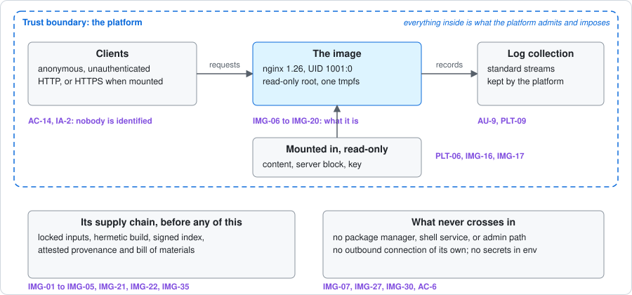
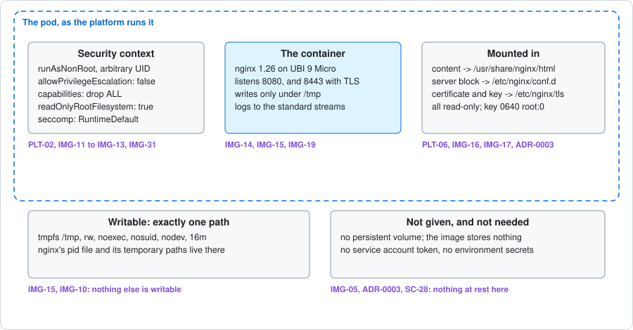
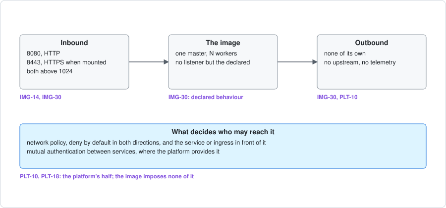
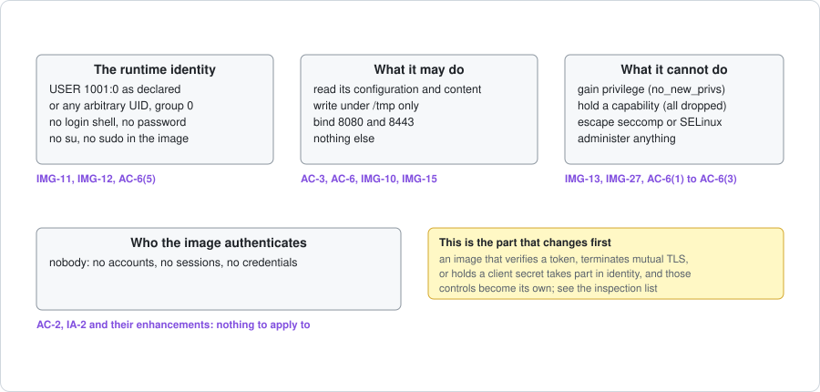
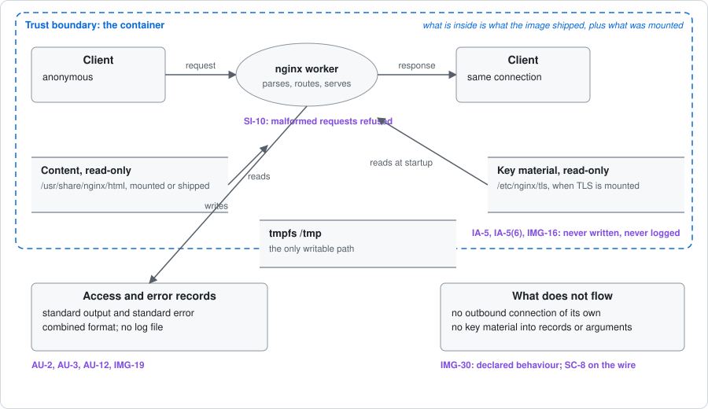
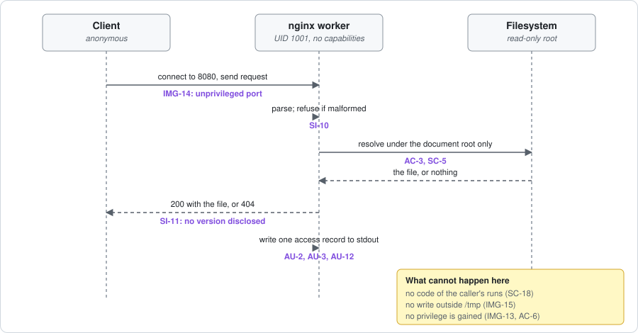
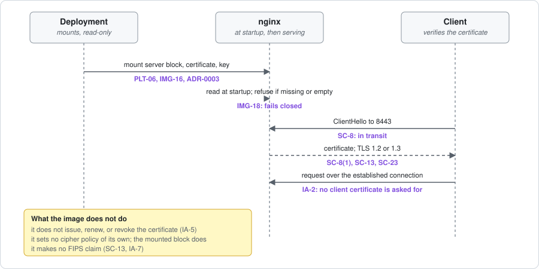
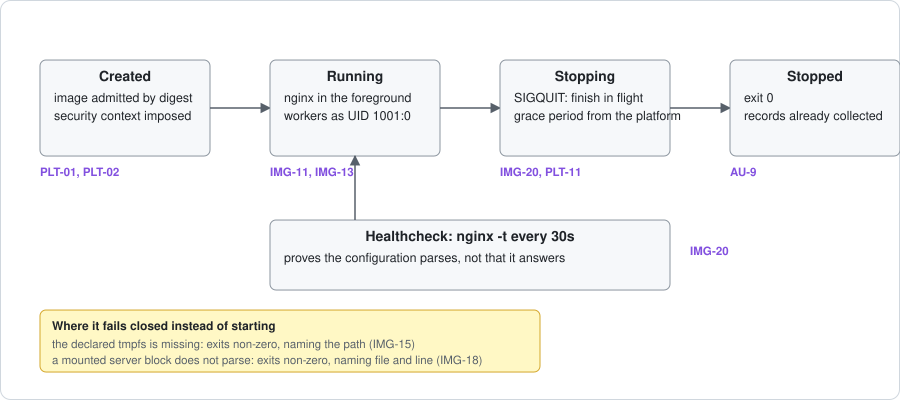
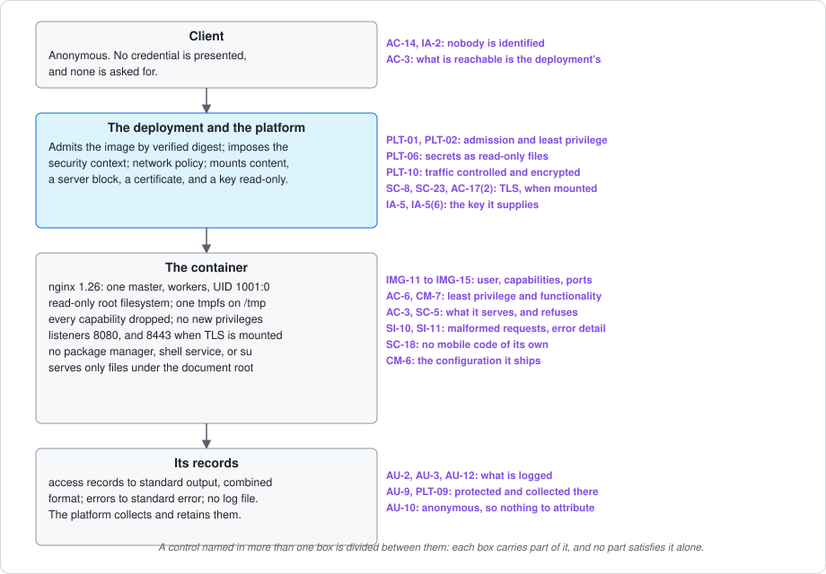

# Cyber package: reference-web-server

What a person has to write down, and no check can produce: what this image is,
where its boundaries are, where each control is applied, and what is still
open. The generated pages beside it say which controls exist and who carries
them; this says where they land in this image, and what a reader should not
conclude from any of it.

| | |
| --- | --- |
| Image | `ghcr.io/datopsis/reference-web-server`, amd64 and arm64 |
| Controls, all of them | [INSPECTION-LIST.md](../INSPECTION-LIST.md): 52 to inspect, 278 inherited, 49 with nothing to apply to |
| What carries each control | [CONTROL-STATEMENTS.md](../CONTROL-STATEMENTS.md) |
| What is evidenced, and how well | [the conformance score](../../../docs/EVIDENCE.md) |
| Its exceptions | [hardening-profile.json](../hardening-profile.json), three deviations |

## What this image is

A static HTTP server: nginx 1.26 on Red Hat UBI 9 Micro, serving files from a
document root, with no management interface, no user accounts, no database, and
no application runtime. It is the standard's worked example, not a product.

It declares two capabilities in its [profile](../hardening-profile.json), and
those decide which controls it must inspect:

- **`serves-http`**: it answers HTTP requests on 8080. What it serves, what it
  refuses, and what it records are its own business, so access enforcement,
  audit, and input and error handling are on its list.
- **`terminates-tls`**: when a deployment mounts a server block, a certificate,
  and a key, it terminates TLS itself on 8443. It then holds key material, so
  authenticator protection and transmission protection are on its list too.

It declares nothing else. It does not authenticate clients, manage accounts,
issue credentials, authorize from claims, offer an administrative interface,
store data that outlives the container, process content it did not produce,
handle mail, call other services, or run as more than one role. Each of those
would add controls; the [inspection list](../INSPECTION-LIST.md) says which.

## Architecture

The image is one process tree in one container. Everything it needs it carries;
everything variable is mounted read-only by the deployment. It reaches nothing
outward.

## Data flow and trust boundaries

Two boundaries matter. The **platform boundary** is what the platform admits
and imposes: the image arrives by verified digest, under a security context it
cannot change. The **container boundary** is what is inside: what the image
shipped, plus what was mounted read-only. A request crosses both.

What crosses in: requests, and the files a deployment mounts. What crosses out:
responses, and records on the standard streams. What never crosses out: key
material, which is read at startup and never written, logged, or placed in
arguments or environment.

## Where the controls are applied

Controls and criteria are many to many. A criterion contributes to several
controls; a control is usually divided between this image, its deployment, the
host, and the organization. **Meeting the image's part does not satisfy the
control.** AC-6 is the clearest case: the image runs unprivileged with no
capabilities, which is its part, while the platform's security context
(PLT-02) and the organization's account practices carry the rest.

Read the per-control detail in [CONTROL-STATEMENTS.md](../CONTROL-STATEMENTS.md);
the diagram above says where in the image each family lands.

## Controls

All 379 are listed in [INSPECTION-LIST.md](../INSPECTION-LIST.md), in three
groups, so a reviewer can walk the whole baseline rather than trust a short
list:

- **52 to inspect**: the baseline gives them to the image or its deployment, or
  a capability brings them in.
- **278 inherited**: the platform, host, or organization carries them. The
  image contributes to some; none is its to answer alone.
- **49 with nothing to apply to**: the thing the control governs is absent.
  This is the group that shrinks first when an image does more, and the one to
  re-read whenever a capability is added.

The inspection list raises nothing for review at present, and nothing outside
the baseline to consider, because neither of this image's capabilities raises
one. Both groups are re-read whenever a capability changes.

**Its 57 decisions are not yet reviewed.** Every control the baseline leaves to
this image has been decided and stated, but no reviewer has signed them off,
which is why the image is not release eligible. That is recorded in the
[decisions worksheet](../decisions.json) and shown in the statements page.

## Evidence

Nothing here is evidence. What this image evidences is recorded by its own
checks and judged by the conformance workflow: 32 of 35 criteria met on each of
amd64 and arm64, from evidence written by the build, the smoke suite, the
supply-chain gates, and the release verification. The
[evidence contract](../../../docs/EVIDENCE.md) defines how that is read, and
what the badges mean.

The release is verified from a clean runner on every release: the index's
signature and provenance, and each architecture's image signature and attested
bill of materials.

## Deviations and what is open

Three criteria are not met, each recorded as a deviation with an owner and an
expiry in the [profile](../hardening-profile.json):

- **IMG-31**: the image has not been deployed under the Restricted Pod Security
  Standard or OpenShift's `restricted-v2` in CI. The smoke suite runs it under
  the properties both require.
- **IMG-33**: this repository's default branch is not yet protected.
- **IMG-16**: nginx does not refuse a world-readable private key. It refuses a
  missing or empty one. Until this closes, protection of that key rests on the
  deployment mounting it correctly (PLT-06), which is why IA-5(6) is recorded
  as deployment-configured.

Five controls stay deliberately open rather than being answered: CM-6 and
CM-6(1) wait on a SCAP profile, SC-13 on the standard's FIPS position, and
SI-10 and SI-11 on criteria that do not yet exist.

## What this package does not claim

- **Not an authorization, and not a STIG result.** It is a description of an
  image and where its controls land.
- **Not an assessment.** No statement here says a control is satisfied; a
  control is satisfied only when every part of it is, including the parts this
  image does not carry.
- **Not evidence.** Evidence is what the checks recorded, scored separately.
- **Not a template for another shape of image.** One process, one role, RPM
  inputs, no identity. An image that authenticates anyone, stores anything, or
  runs as several roles inspects a longer list and needs its own package.
